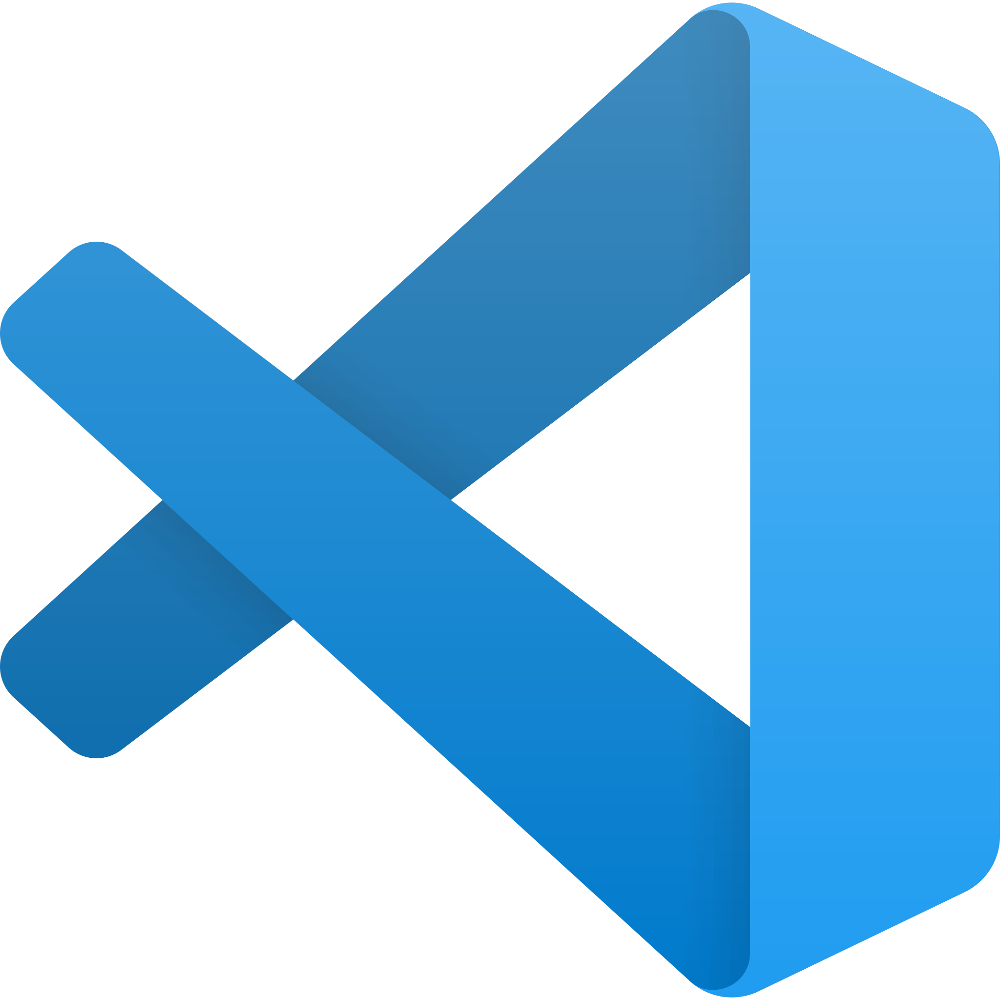
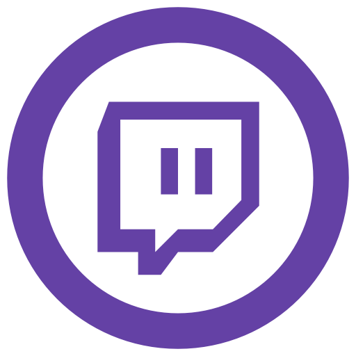

# Hi 👋, I'm Alice

### "*If I want to be a competent Frontend Developer, I'm ready to be a longlife student* 😅"

<!--
**alice-sebego/alice-sebego** is a ✨ _special_ ✨ repository because its `README.md` (this file) appears on your GitHub profile.
-->
---
```javascript
let yourCompany = ["My current team"];
let me = "Alice";
let match = true;
 
const collaboration = (company, applicant, ismatch) => {  
    try {
      if(ismatch) {
        company.push(applicant);
        return `An awesome collaboration is announced between ${company[0]} and ${company[1]} 🤩`;
      }
    } catch (err) {
      return `Oh there is an error : ${err} \n Okay ! Let's wish a good continuation 🙂`;
    }  
}

collaboration(yourCompany, me, match)
```
## About me

🌱 #CodeNewbie, I’m currently learning **Vue.JS, TypeScript, Node.JS and Flutter**

   


 After several experiences, self-taught learning and 4 trainings (in 2009, 2019 and 2021-25), I'm currently working with a team to grow up via a work-study journey.

 With several years of experience in front-end development, I am passionate about creating engaging user experiences and continuously improving my skills.

 I'm very proud and grateful of my projects and collaborations with Obione Team.

 1000 thanks for all their support and encouragement along my journey.

## Langages, Frameworks & Tools

| Frontend      | Others        | Tools |
| ------------- |:-------------:| -----:|
|  |  |  |
|  |  |  |
|  |   |  |
|  |  |  |
|  |  |  |

## Software

  

## Others Skills

Graduated in communication, I've got skills on : 
* SEO
* Google tools (Google Analytics, Google Search Console, Google My Business & Google Adwords)
* Web writing
* Digital marketing

---

<p></p>
<p></p>

---
## Follow us

<a href="https://linkedin.com/in/alicesebego" target="blank"></a>
<a href="https://twitter.com/comamalice" target="blank"></a>
 

On Twitch, we can chat on some channels that I follow :

1. [BenjaminCode](https://www.twitch.tv/benjamincode "Benjamin Code")
2. [Grafikart](https://www.twitch.tv/grafikart "Grafikart")
3. [IAmSeanRed](https://www.twitch.tv/iamseanred "IamSeanRed")
4. [Liior](https://www.twitch.tv/liior "Liior")
5. [WeLoveDevs](https://www.twitch.tv/welovedevs "We Love Devs")

---


